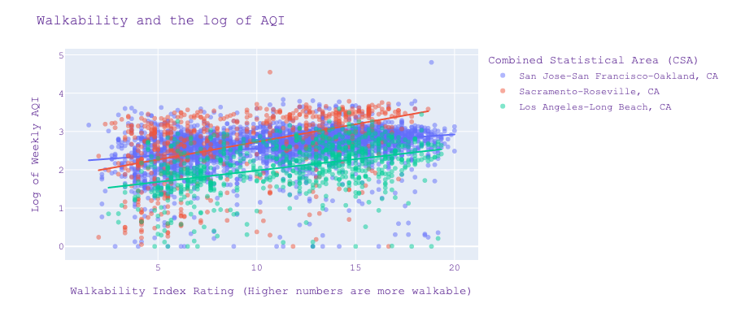

# Project 4: Walkability & Air Quality in Los Angeles

### Problem Statement:
This is a regression problem that predicts whether the walkability of the Los Angeles area correlates with air quality. The goal of this analysis is to determine if areas of high walkability are also areas with good air quality -- particularly within the Los Angeles area whose walkability and air quality can vary depending on accessibility to public transit, forest fires, and proximity to the ocean.  

Looking at the [U.S. EPA Walkability Index](https://edg.epa.gov/metadata/catalog/search/resource/details.page?uuid=%7B251AFDD9-23A7-4068-9B27-A3048A7E6012%7D) which highlights the walkability of a region (using census data from 2017-2019 and other data sources) and air quality data pulled from the [PurpleAir API](https://github.com/ReagentX/purple_air_api), we are hoping to determine if regions (CBSAs & CSAs) with high walkability also have good air quality.

Our stakeholders are families who want to move to Los Angeles in an area of both good walkability and good air quality.

### Executive Summary: 
Our team started the project with the goal of predicting air quality given walkability across the United States with the ultimate goal of determining if a CBSA & CSA region with high walkability would also have good air quality.  Our goal is to help our stakeholders who are families who want to to move to different regions across the country. Doing this type of analysis required merging a number of datasets including the EPA's 2021 walkability index dataset along with an air quality dataset. Initially, we opted to use the EPA's annual air quality index dataset. However, merging these two datasets proved challenging because the data within the walkability dataset was much more localized than the air quality data -- we could not merge the data without omitting large sections of the walkability dataset or finding ways to generate more granular data for the air quality dataset.

In searching for more granular air quality data, we came across a company called PurpleAir, which sells air quality monitors to everyday conusumers at a price of $249-$279 per monitor. We scraped their API to grab all the metrics of their air quality data, keeping our focus on the USA. The air quality monitors were more prevalent on the West coast of the USA, which aligned with our focus on Los Angeles. This area proved to be an interesting choice because it is both large and diverse enough to provide a mixed outlook on air quality and walkability throughout different neighborhoods -- with some regions being metro accessible, some being near the ocean and others being subject to the ongoing fires and arid conditions that unfortunately plague much of California. 

For the modeling phase we wanted to prioritize interpretability so we used linear regression models with a small feature set. Sequential feature selection was used to determine the best features to use to optimize score given our constraints. Our final model was trained on the Los Angeles-Long Beach CSA and explained about 35% of variance in that dataset using 5 features. Working age population within a 45 minute commute and the percentage of jobs in the office and industrial sector are associated with worse air quality. Furthermore, percent of households with 2 or more cars and the acreage of the census block tract were associated with better air quality. Together, these results suggest that air quality is better in traditional suburban areas vs urban areas.

### Contents: 

#### Folders:

I: Data 
- Contains raw, collected, intermediate and cleaned data used in the project.

II: Scratch Work
- Unpolished, draft code.

III: Images
- Generated images

#### Files:
* **00_purple_air_scrape.ipynb**  
Collects purple air sensor network data using the [Purple Air API](https://github.com/ReagentX/purple_air_api).  
* **01_data_merge.ipynb**  
Adds fips code to purple air data using the [FCC Block API](https://geo.fcc.gov/api/census/#!/blockget_block_find) and merges with the walkability dataset.  
* **02_eda_correlations.ipynb**  
Correlations used to explore data and confirm target choice on raw, unscrubbed data.  
* **02_eda_main.ipynb**  
Removes extra columns, imputes missing values, and transforms data.  
* **03_visualizations.ipynb**  
Visualization EDA, scatter plots against air quality, feature correlation lists, box & violin plots.  
* **04_modeling.ipynb**  
Linear Regression modeling with Sequential Feature Selection on full and LA dataset.  Also contains 57 feature LA Linear Regression Model.  
* **05_presentation.pdf**  
* **requirements.txt**  
* **walkability_data_user_guide.pdf**   
Technical documentation provided with the EPA's Walkability dataset.   

### Data Sources:
##### Air Quality:
The air quality data was obtained from the PurpleAir API. It contained latitude, longitude, indoor/outdoor indicator, daily temperature, humidity and pressure readings in addition to the average weekly measure of PM2.5 particles.  This data was pulled from the PurpleAir website using the PurpleAir API.

PurpleAir data is concentrated in California. The largest regions are San Francisco, Los Angeles, and Sacramento, distantly followed by Denver and New York.
The full dataset included about 14,000 distinct locations.
The data also included some international locations but we filtered it to only the United States.

The EPA establishes an Air Quality Index (AQI) for 5 major air pollutants regulated by the Clean Air Act. Each of these pollutants has a national air quality standard set by EPA to protect public health: 1) ground level ozone, 2) particle pollution, 3) carbon monoxide, 4) sulfur dioxide, and 5) nitrogen dioxide. 

For our problem we will use particle pollution as our proxy for air quality.  Specifically, we will predict the average weekly PM2.5 (particulate matter < 2.5 micrometers in diameter) for our analysis.

The EPA shares a daily Air Quality Index complete with a daily color and concern level.  A lower Air Quality Index is better:  for example, an index between 1 and 50 indicates a green level (the best!), with a concern level of "good", indicating that there are no worries about Air Quality at this index.  Conversely, the highest/worst Air Quality Index levels are 301 and higher, have a color of maroon and indicate hazardous air quality.  So, the two important things to remember about this is that red isn't the worst index level, and a lower index indicates better air quality.

The PurpleAir outdoor monitors range in price from $249 to $279, so they are less likely to be found in lower income areas.  For the purposes of our analysis, we only used data from outside monitors.

##### Walkability:
The walkability data is also published by the EPA and can be downloaded at (https://www.epa.gov/smartgrowth/smart-location-mapping).

Walkability is the likelihood that walking can be used as a mode of travel.

This data includes metrics in five primary categories - density, diversity, design, transit accessiblity, and destination accessibility - and combines them into an overall walkability index ranging from 1-20 (higher scores are better). 

The dataset includes 117 features on ~221,000 observations across the US. For methodological reasons rural areas are excluded.  The walkability dataset was previously built from various resources (Census data from 2017-2019, HERE Maps, U.S. Geological surveys, Center for Transit-Oriented Development & other transit sources).

##### Features include:
* Geographic info - FIPs codes
* Demographics
* Employment metrics
* Built environment measures like residential and employment density, land use diversity, design of the built environment, access to destinations, and distance to transit.

#### [Data Dictionary](https://docs.google.com/spreadsheets/d/1r2PsolJEZtMx6HIJzTZFNOOO5BFDuejNbNi8Xu0Aalg/edit#gid=0)

#### Merging Data 
FIPS code gives us granular information down to the block level.
We used the [FCC Block API](https://geo.fcc.gov/api/census/#!/block/get_block_find) to get the FIPS codes for the PurpleAir dataset from the latitude longitude coordinates.
The two data sets were merged on FIPS code and the merged data has 140 features on 9,500 observations across the United States,

#### Cleaning Data
* We chose observations that are in Los Angeles or other regions
* We also filtered air quality data to outside sensors (indoor sensors will have different patterns, this project is focused on modeling outside air quality).
* We dropped redundant & low variance features.
* We imputed nulls & irregular values (-99999 was used as a place holder for some transit metrics where transit was missing).
* We clipped off outliers.

#### EDA Learnings
We created visualizations for three CSAs that contained the bulk of our PurpleAir data:  San Jose - San Francisco - Oakland, Sacramento-Roseville,  Los Angeles - Long Beach, all in California.
* The number of high wage earners is comparable by region and by locality, meaning that there likely isn't an additional financial incentive for a family moving to California to prioritize a particular region or locality.
* Given that urban and suburban regions were divided at the median population density marker, we did notice that urban regions had significantly worse air quality than suburban regions, with Los Angeles having the best air quality overall independent of locality.
* The impact of being closer to your job on air quality is less pronounced in urban areas, where people are generally already closer to their jobs and experiencing poorer air quality. For suburban areas, as workers get closer to their jobs, air quality noticeably decreases
* The same trend persists across all three regions, where as people get closer to their jobs, air quality decreases -- Los Angeles remains the region with the best air quality and most jobs within 45 minutes of potential employees.
* Ultimately, the EDA process seemed to affirm that as walkability improves, air quality decreases, in all regions.

### Modeling
We built linear regression models with a focus on building sparse and interpretable models. Therefore we did not use the full feature set model as our final model, even though it had a better score. 

#### Feature Transformations
Where appropriate, we applied log or power transformations to make our features more normalized. We also converted some features from raw scores to percentages to make comparison easier across areas. For example, the percentage of unprotected land (excluding i.e. parks) out of total land is easier to compare than the area of unprotected land for differently sized CBSAs.

#### Model Comparison
| Model | r2 score |
| :-: | :-: |
| Baseline | 0.0 |
| 6 Features (National Model) | 0.268 |
| 5 Interpretable Features (LA) | 0.347 |
| 8 Features (LA) | 0.368 |
| 57 Features (LA) | 0.443 |Comparison

Additionally, focusing on just one region, LA, makes it easier to model than the full dataset.

#### LA Model (5 Interpretable Features)

| Feature | Expected Change in log AQI per unit |
| :-: | :-: |
| Log of Working Age Population Within 45 Minutes Car Commute | 0.1843 |
| Proportion of Jobs in Office Sector | 0.0036 |
| Proportion of Jobs in Industrial Sector | 0.0028 |
| Porportion of Households with 2+ cars | -0.0046 |
| Log of Census Block Group Acreage | -0.0799 |

The "5 Interpretable Features" model was selected to optimize score and interpretability. Sequential feature selection (greedily) optimizes score for a small feature set. We also removed highly correlated features.

Overall, several features suggest that suburban areas indicated by more two car households, greater area, a lower nearby working age population and fewer office / industrial jobs have better air quality.

#### Limitations

* Any changes in calculations to the EPA walkability features or methodology will impact our model. Dataset is difficult to build, published every 5-10 years.
* PurpleAir sensors are not representively distributed by geography or wealth.
* Air quality varies considerably by time, weather, season, and local wildfire status
* 1 week average does not completely capture the nuance of air quality / harms on public health.
* There is a lot of variance, and much of it can’t be explained by demographic variables we considered in our analysis

### Conclusion:
Air quality is a key environmental factor determining public and personal health and quality of life. It can play a role in deciding where to live.

Air quality varies considerably across California. In the 3 major CSA regions LA had the best air quality followed by San Francisco and Sacramento. Suburban regions have better air quality than urban ones, despite the impacts of car pollution.

### Further Study:

Additional areas to expand the project might be to look at the impact of different feature sets (i.e. just mix of employment types) to determine which features are most powerful in predicting air quality. 
We could also consider more complex models, to see how much accuracy was sacrificed by using a linear regression model. 
Finally there are a number of other factors such as cost of living that influence where families might want to live and we could analyze the tradeoffs between those factors and air quality.
